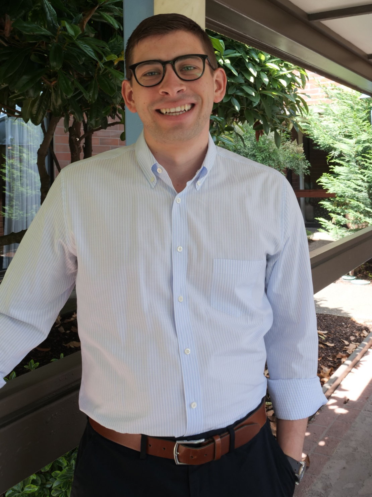

<!--  -->

I am a 5th year Astronomy Ph.D. student at the [University of Maryland](https://www.astro.umd.edu/). Most of my research is focused on modeling the dynamics of the binary asteroid Didymos in support of NASA’s Double Asteroid Redirection Test ([DART](https://dart.jhuapl.edu/)) Mission. However, I am also broadly interested in solar system dynamics, planetary defense, and scientific computing. You can download my CV [here](pdfs/agrusa_CV_May2022.pdf).

## Contact

Email: [hagrusa@astro.umd.edu] 
Twitter: [@harrisonagrusa] 

University of Maryland 
4296 Stadium Drive 
Astronomy Dept Room 1113 
College Park, MD 20742 

[@harrisonagrusa]: https://twitter.com/harrisonagrusa
[hagrusa@astro.umd.edu]: mailto:hagrusa@astro.umd.edu