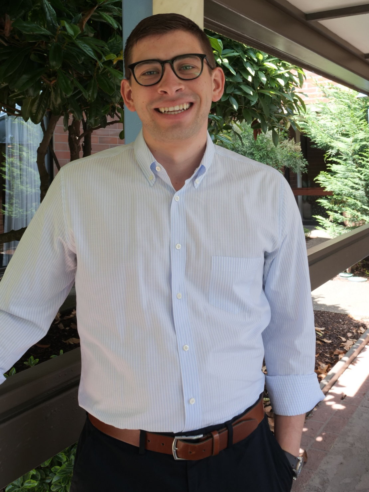

<!--  -->
# Harrison Agrusa

I am an astrophysicist and planetary scientist broadly interested in solar system dynamics and scientific computing. I recently received my Ph.D. from the [University of Maryland](https://www.astro.umd.edu/) where most of my research has focused on the dynamics of the binary asteroid Didymos in support of NASA’s Double Asteroid Redirection Test ([DART](https://dart.jhuapl.edu/)) Mission. You can download my CV [here](pdfs/agrusa_CV_apr2023.pdf) (last updated: April 2023).

You can find my Google Scholar profile [here](https://scholar.google.com/citations?hl=en&user=4Wbb_iUAAAAJ) and a listing of my publications on NASA ADS [here](https://ui.adsabs.harvard.edu/search/filter_property_fq_property=AND&filter_property_fq_property=property%3A%22refereed%22&fq=%7B!type%3Daqp%20v%3D%24fq_property%7D&fq_property=(property%3A%22refereed%22)&q=%20author%3A%22Agrusa%2C%20Harrison%22&sort=date%20desc%2C%20bibcode%20desc&p_=0).

## Contact

Email: [hagrusa@oca.eu] 
Twitter: [@harrisonagrusa] 

[@harrisonagrusa]: https://twitter.com/harrisonagrusa
[hagrusa@oca.eu]: mailto:hagrusa@oca.eu

## Gallery

Here is a (seldomly updated) list of old movies from numerical simulations.

<!-- As a grad student, my research has (mostly) focused on studying the dynamics of the Didymos binary asteroid in support of NASA's DART mission. The challenge with modeling the spin and orbital evolution of these small binary systems is that their shapes are irregular and the two components are close together, meaning the system has a high degree of spin-orbit coupling and that the dynamics are non-Keplerian.  -->

 <!-- In my first paper, we benchmarked several codes and studied the sensitivity of the Didymos system to changes in initial conditions. Based on the findings of the benchmarking paper, we then studied the post-impact attitude evolution of Dimorphos as a function of its (unkown) shape and the momentum enhancement factor, . -->

Here's a movie where we simulate the dynamical evolution of the Didymos system following a DART-like impact. This animation shows the secondary component (Dimorphos) librating following the impact. Then, some time later, you can see Dimorphos become attitude unstable. The attitude stability properties are highly dependent on its shape and the magnitude of the perturbation provided by DART. We studied Dimorphos' post-impact attitude stability in-depth in this [paper](https://ui.adsabs.harvard.edu/abs/2021Icar..37014624A/abstract) if you want to learn more!

<iframe width="600" height="300" src="https://www.youtube.com/embed/GYFmhL8I8OA" title="YouTube video player" frameborder="0" allow="accelerometer; autoplay; clipboard-write; encrypted-media; gyroscope; picture-in-picture" allowfullscreen></iframe>

<!-- Here's an old gif where we simulated the Didymos system using pkdgrav, a parallel n-body code:
 -->

Here is a similar simulation, this time in a rotating frame:
 <iframe width="600" height="300" src="https://www.youtube.com/embed/ZkdqxPbH5Pg" title="YouTube video player" frameborder="0" allow="accelerometer; autoplay; clipboard-write; encrypted-media; gyroscope; picture-in-picture" allowfullscreen></iframe>

Here's an old gif where we simulated the Didymos system using pkdgrav, a parallel n-body code:
 